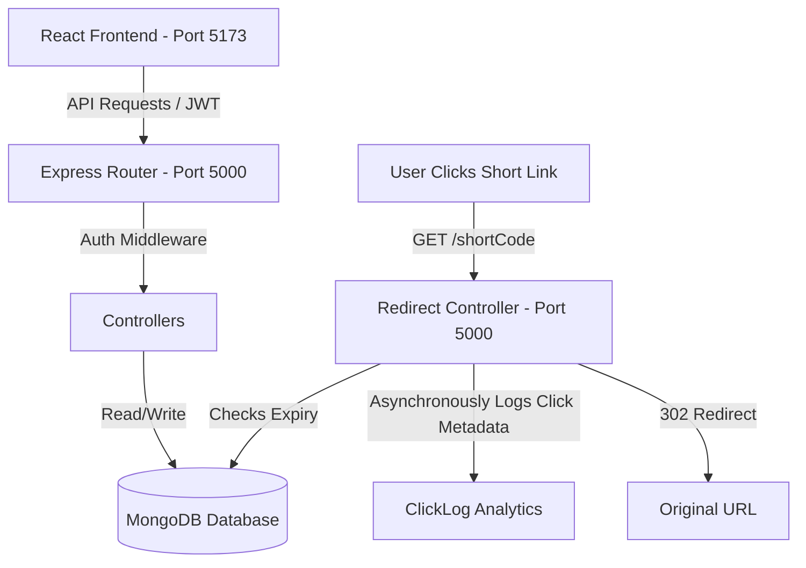

# SnipURL | Premium URL Shortener & Analytics Dashboard

SnipURL is a premium, full-stack link management platform. Built using **React (Vite)**, **Node.js (Express)**, and **MongoDB (Mongoose)**, it offers a secure, responsive, and aesthetically stunning dashboard for shortening URLs, managing custom aliases, specifying link expirations, generating downloadable QR codes, bulk-importing links via CSV, and viewing detailed audience metrics.

---

## 🌟 Features Implemented

### 🔒 Authentication
- **Secure Registration & Login**: Validated email constraints and password hashing via `bcryptjs`.
- **JWT-Protected Dashboards**: Custom Express middleware to authenticate routes. Users can only access, delete, and analyze their own links.

### 🔗 URL Shortening & Management
- **Single Shortening**: Accepts long URLs, verifies protocol syntax (`http://` or `https://`), and generates unique 6-character alphanumeric keys.
- **Custom Aliases**: Option to assign specific readable paths (e.g. `/summer-sale`) with duplicate validation.
- **Expiration Limits**: Allows users to set date-time constraints. Expired links serve a clean server-side HTML alert.
- **In-place Editing**: Users can update the destination URL of any active link without changing the shortened code.
- **Downloadable QR Codes**: Generates high-quality QR codes on the dashboard that are instantly downloadable as PNG images.
- **Bulk CSV Shortening**: Allows uploading CSV files containing columns for URLs, custom aliases, and expirations. Includes a downloadable CSV template.

### 📊 Audience Analytics Dashboard
- **Aggregate Widgets**: Quick metrics for total links, total clicks, and sync status.
- **Click Trend Charts**: Interactively displays daily click frequencies over the past 14 days using **Recharts**.
- **User Agent Breakdown**: Aggregates and displays browser, operating system (OS), and device type (Desktop, Mobile, Tablet) breakdowns using progress percentages.
- **Live Activity Logs**: Table showing IP address, timestamp, device, OS, browser, and referrer for the latest redirects.

---

## 🏗️ Application Architecture

The system utilizes a modern, decapped Client-Server architecture:



### Database Models

#### 1. User
- `email`: Unique, lowercase, validated email string.
- `password`: Hashed using `bcryptjs` (salt factor 10).
- `createdAt`: Date user registered.

#### 2. Url
- `user`: Reference ID of the owner.
- `originalUrl`: Validated destination URL.
- `shortCode`: Unique, indexed alphanumeric string or custom alias.
- `customAlias`: Optional unique string.
- `title`: Scraped domain title for dashboard visual identification.
- `clicksCount`: Counter incremented on redirection.
- `expiresAt`: Optional date-time limit.
- `createdAt`: Timestamp of creation.

#### 3. ClickLog
- `urlId`: Reference ID of the shortened link.
- `timestamp`: Date-time of click.
- `ip`: IP address.
- `userAgent`: Unfiltered user agent string.
- `browser`: Parsed browser name (e.g., Chrome, Safari).
- `os`: Parsed operating system name (e.g., Windows, macOS, Android).
- `device`: Parsed device category (Desktop, Mobile, Tablet).
- `referrer`: Redirect source URL (or 'Direct').

---

## ⚡ Zero-Configuration Startup (MongoDB Fallback)
To make the application instantly reviewable without requiring local MongoDB installations:
- If no `MONGODB_URI` environment variable is defined, the backend will **automatically spin up an in-memory MongoDB database** (`mongodb-memory-server`).
- The in-memory database runs in the background for the duration of the server execution, enabling fully-functional authentication and click-tracking with **zero configuration**.

---

## 🚀 Setup & Execution Instructions

### Prerequisites
- [Node.js](https://nodejs.org/) (v18 or higher recommended)
- [npm](https://www.npmjs.com/) (installed automatically with Node)

### 1. Installation
In the root directory, run the installation script. This installs all dependencies for both the frontend and backend:
```bash
# In the project root folder:
cd backend && npm install
cd ../frontend && npm install
```

### 2. Configuration (Optional)
A `.env` template file is configured in `backend/`. If you want to connect to a persistent database (e.g. MongoDB Atlas), add your URI:
```env
PORT=5000
MONGODB_URI=mongodb+srv://<user>:<password>@cluster.mongodb.net/snipurl
JWT_SECRET=supersecretkeyforurlshortener123!
BASE_URL=http://localhost:5000
FRONTEND_URL=http://localhost:5173
```
*Note: If `MONGODB_URI` is left blank, the app runs the zero-config in-memory database.*

### 3. Running the Application (Windows)
Double-click the `run-app.bat` script in the root directory. This will automatically open two terminal windows:
1. **Backend Server** running on `http://localhost:5000`
2. **Frontend Dev Server** running on `http://localhost:5173`

*(On macOS or Linux, run `npm run dev` in `backend` and `npm run dev` in `frontend` in separate terminals).*

---

## 📝 Assumptions Made
1. **Local Redirection Port**: Redirection occurs on the backend server (`http://localhost:5000/shortCode`), which logs analytics and issues a `302 Found` header redirect.
2. **Local Storage Session**: Authentication state is stored as a JWT token in the browser's `localStorage` for visual SPA fluidity.
3. **Redirection Log Accuracy**: If localhost/local network clicks occur, the IP will log as loopback `::1` or `127.0.0.1`, which is normal local development behavior.

---

## 📹 Explanatory Video
Please find the demonstration and walkthrough video explaining the application structure and code:
- **Video Link**: *[Insert Loom or YouTube URL here]*

---

This project is a part of a hackathon run by https://katomaran.com
